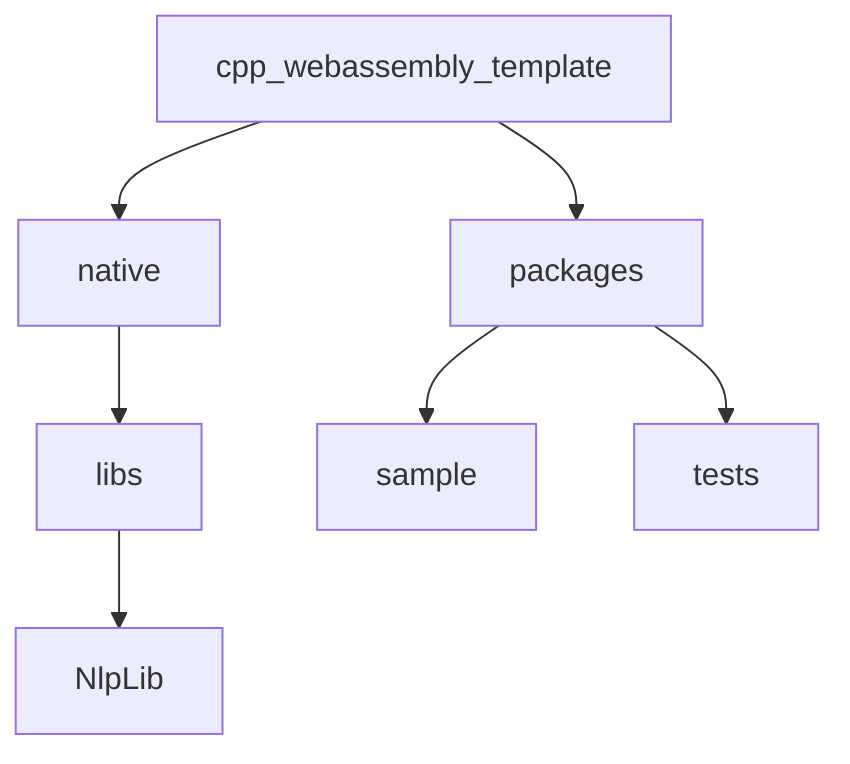

# C++ WebAssembly starter template

C++/CMake WebAssembly Project Template. A minimal, modular C++ monorepo structure with static libraries and unit tests, configured with CMake and Emscripten for building WebAssembly applications. Perfect starting point for creating high-performance web apps or games in C++ that run in the browser.

## Project structure

The repository is organized as a monorepo with the following main components:

- **native/**: Root for all C++/CMake sources and Emscripten build scripts.
  - **libs/**: Contains modular C++ libraries (e.g., NlpLib).
- **packages/**: TypeScript client and server applications, plus tests.
  - **sample/**: Example TypeScript application consuming the WebAssembly module.
  - **tests/**: TypeScript tests for the WebAssembly functionality.

### Structure Graph



- **native/libs/NlpLib**: Example C++ library for NLP/text processing.
- **packages/sample**: Loads and uses the generated WebAssembly module.
- **packages/tests**: Tests the WebAssembly module from TypeScript.

## Prerequisites

To build and run this project, you will need:

- **CMake** (version 3.15 or higher)
- **Emscripten SDK** (latest recommended version)
- **Node.js** (version 18 or higher)
- **Python 3** (required by Emscripten)
- **A C++ compiler** (for native builds and tests)
- **vcpkg** (optional, for managing C++ dependencies; see [vcpkg](https://github.com/microsoft/vcpkg) for installation and usage)

**Setup instructions:**

1. Install [Emscripten SDK](https://emscripten.org/docs/getting_started/downloads.html) and activate it:

- The setup expects emsdk installed in the home folder (e.g. `~/emsdk`). Overwise, set environment variable `EMSDK` to the location of your choice.

- Linux/MacOS:

   ```sh
   git clone https://github.com/emscripten-core/emsdk.git
   cd emsdk
   ./emsdk install latest
   ./emsdk activate latest
   source ./emsdk_env.sh
   ```

- Windows:

   ```bat
   git clone https://github.com/emscripten-core/emsdk.git
   cd emsdk
   emsdk install latest
   emsdk activate latest
   emsdk_env.bat
   ```

2. Install [CMake](https://cmake.org/download/) and [Node.js](https://nodejs.org/).
3. Run `npm install` in the project root to install JavaScript/TypeScript dependencies.

## Building and Running

### Build Native WebAssembly Module

To build the C++ code to WebAssembly:

```sh
npm run build:native
```

This will invoke CMake and Emscripten to produce the `.wasm` and JavaScript glue files in the build_wasm directory.

### Build and Start the TypeScript Sample App

To build and start the sample TypeScript application that consumes the WebAssembly module:

```sh
npm run dev
```

- `npm run build` performs a full build of all packages and native code.
- `npm run dev` builds and starts the development server for the sample app.

### Run Tests

To run the TypeScript tests for the WebAssembly module:

```sh
npm run test
```

## Contributing

Contributions are welcome! Please open issues or submit pull requests for improvements, bug fixes, or new features.

## License

This project is licensed under the MIT License. See the [LICENSE](./LICENSE) file for details.

## Acknowledgements

- [Emscripten](https://emscripten.org/)
- [CMake](https://cmake.org/)
- [Catch2](https://github.com/catchorg/Catch2)
- [TypeScript](https://www.typescriptlang.org/)
- [vcpkg](https://github.com/microsoft/vcpkg)

